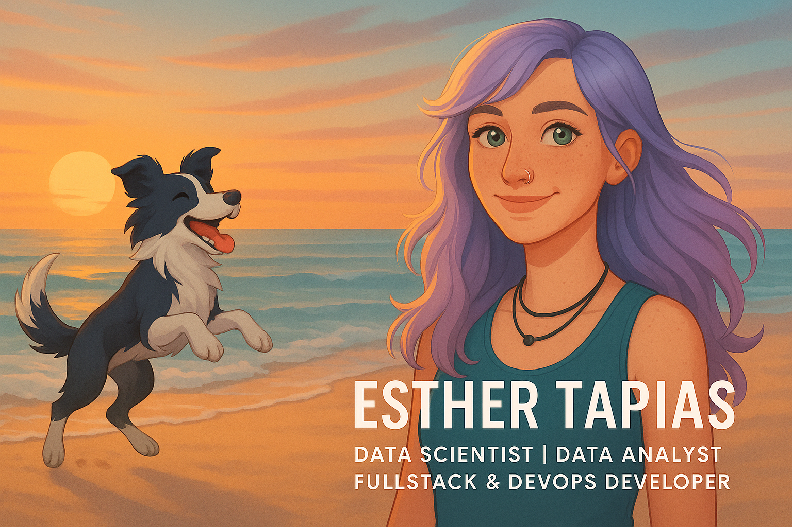

<!-- Banner de cabecera -->

  

# 👋 ¡Hola! Soy Esther

💡 Fullstack Developer | DevOps en formación | Data Scientist | Data Analyst | Exploradora de la IA y los Datos

---

📍 Desde **San Fernando (Cádiz)** al mundo digital. Tras más de 5 años como Office Manager, decidí dar un giro profesional hacia la tecnología.  
Hoy me encuentro en pleno viaje de transformación, formándome como **Desarrolladora Fullstack con enfoque DevOps**, sin olvidar mi pasión por la **Inteligencia Artificial y la Ciencia de Datos**.

---

## 🚀 Formación en marcha

🎓 Bootcamp **Fullstack + DevOps**  
🔬 Formación previa en **Inteligencia Artificial & Ciencia de Datos**

---

## 🛠️ Tecnologías que estoy aprendiendo

### 🖥️ Frontend  

### 🔧 Backend & DevOps  
   

### 🧠 Inteligencia Artificial & Ciencia de Datos  
     

### 🗄️ Bases de Datos y Herramientas  
  

**...y muchos más 🛠️**

---

## 👩‍💻 ¿Qué encontrarás en mi GitHub?

  
📁 Proyectos en desarrollo

- 🌐 Aplicaciones web con React & Node.js  
- ⚙️ Automatizaciones con Bash y GitHub Actions  
- 📊 Visualizaciones y análisis de datos  
- 🧠 Mini proyectos de IA y aprendizaje automático  
- 🧪 Pruebas unitarias con JavaScript y Jest  

  
🧠 Objetivos actuales

- 🧱 Dominar el stack MERN (MongoDB, Express, React, Node)
- 🔄 Implementar flujos CI/CD y contenedores con Docker
- 🤖 Aplicar modelos de machine learning a casos reales
- 🧠 Unir el desarrollo con la inteligencia de los datos

---

## 🐾 Un poco más sobre mí

Cuando no estoy programando, me encontrarás paseando con **Nahko**, mi perro y compañero de aventuras.  
Su energía y fidelidad me inspiran a ser constante, adaptable y optimista en todo lo que hago. 🐶💛

---

## 📊 Estadísticas de GitHub

  

  

---

## 👀 Contador de visitas

  

---

## 📫 ¿Conectamos?

  
  

💬 ¡Estoy abierta a colaborar, aprender en comunidad o simplemente compartir experiencias tech!

---

> 💬 “No tienes que ver toda la escalera, solo da el primer paso.” – Martin Luther King Jr.

